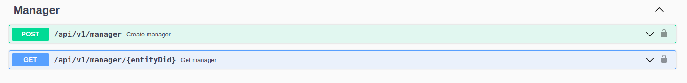

# LACPass Client

## Overview

This repository integrates the base functionalities needed for LACPass in order to handle the onboarding process for each Entity.

## Requirements

Before interacting with this API, please make sure that:
* You have access to a running instance of this application.
* You have access to a Terminal.
* You have curl installed.

## APIs

### Identity API

* Please follow the instructions detailed [here](https://github.com/lacchain/LACPass-identity/blob/master/docs/API-Guide.md)

### Chain Of Trust API

At a high level, Chain Of Trust provides the ability to any participant (A) to endorse Trust to their sub departments (B), So other entities (C) trusting A can thus to trust B. This may be especially useful for environments where a common layer of trust is needed between different organizations. With this feature enabled, for example, the Government of Surinam (C) can Trust some specific digital Health report issued by a Brazilian Health Care sub department (B) for a citizen in that Country; in this scenario it is assumed that Ministry of Surinam trusts the Ministry of Brazil; additionally the Ministry of Health of Brazil endorsed trust to its sub Health department thus allowing the Government of Surinam to trust some specific digital Health report issued by that Brazilian Health Care sub department.

* Interacting with this api is straightforward when using the interface provided via Swagger, just enter into the port exposed when running this service
and then you will find the following methods:
  * Create a manager: This requires just the DID (Decentralized Identifier) you obtained when interacted with the Identity methods. You can only create one manager for each entity. This method will allow you to create the manager through which you will endorse trust to other sub entities.
  * Get Manager: Returns the details of the manager created by the previous method. Basically a manager is just a sequence of characters called "address".
  * Add a trusted sub entity: TBD

To interact with this API you can just enter the Swagger exposed in: http://<HOST_WHERE_APP_IS_RUNNING>:<PORT>/docs/#/

